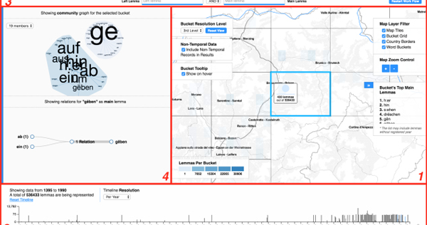

# Collection Explorer
With collection explorer user may search for lemmas or parts of compounds. Results are displayed on a map in the shape of buckets. Words or word elements are displayed as community graphs and word relations. Filtering by timeline is also possible. Users may zoom into individual entries by clicking on the buckets. 



This code is related to the **ExploreAT!** Project. 
This project aims to reveal unique insights into the rich texture of the German Language, especially in Austria, by providing state of the art tools for exploring the unique collection (1911-1998) of the Bavarian Dialects in the region of the Austro-Hungarian Empire. This corpus is large and rich, estimated to contain 200,000 headwords in estimated 4 Million records. The collection includes a five-volume dictionary of about 50,000 headwords, covering a period from the beginning of German language until the present (DBÖ, WBÖ).

This work has generated some publications that can be found [here](https://exploreat.usal.es/our-publications). The one that shows the work accomplished by this applications is located [here](https://exploreat.usal.es/publication/spatio-temporal-visual-analysis-tool-historical-dictionaries).

## Getting Started

These instructions will get you a copy of the project up and running on your local machine for development and testing purposes. See deployment for notes on how to deploy the project on a live system.

### Installing

Dependencies are been migrated from [Bower]() with [bower-away](). Therefore yarn or npm may be used for installing
the dependencies.

As indicated in **Bower** official site, it is recommended not to use it to manage the dependencies.

```
yarn
```
or
```
npm install
```

You can use any static server of your choice to serve the files for the webpage.
Additionally, [webpack](http://www.dropwizard.io/1.0.2/docs/) may be used for compiling the source code
and package it into a few files (friendlier with download speed for the webpage).

**Please note the data necessary to run this project is currently owned by the [Center for Digital Humanities at the Austrian Academy of  Sciences](http://www.oeaw.ac.at/acdh/) and it is not in the public domain yet. Please contact the center in case you are interested in using the data.**

## Authors

* [Alex Benito](https://github.com/ale0xb) - *Implementation of the prototype* 

## License

This project is licensed under the MIT License - see the [LICENSE.md](LICENSE.md) file for details

